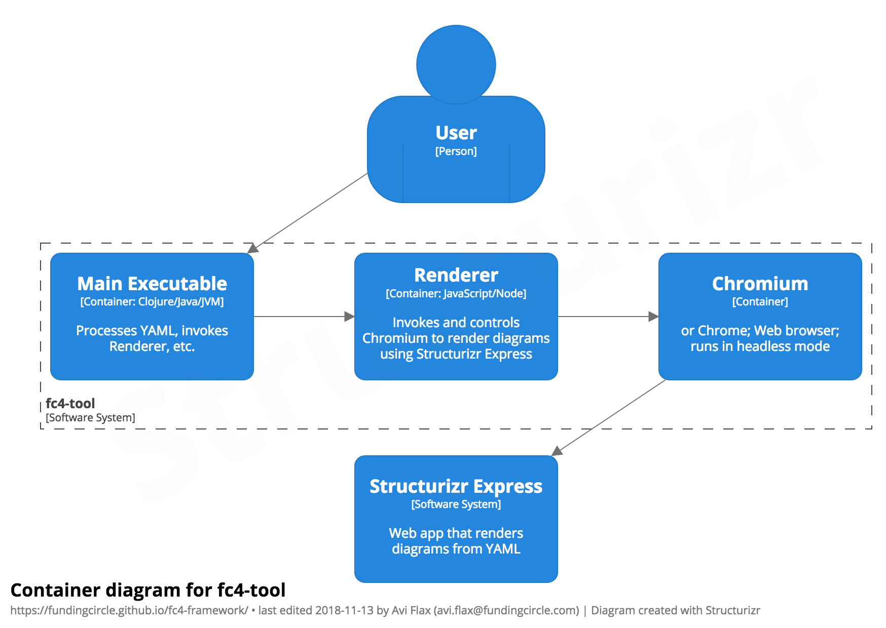

# The FC4 Framework

<figure style="float: right; border: 1px solid silver; padding: 1em; margin-top: 0; text-align: center;">
  
  <figcaption>Example: a container diagram of fc4-tool.</figcaption>
</figure>

FC4 is a [_Docs as Code_][docs-as-code] framework that enables software creators to author, publish,
and maintain software architecture diagrams more effectively, efficiently, and collaboratively over
time.

It has two components:

* [the methodology](methodology/)
* [the tool](tool/)

It builds on [the C4 Model][c4-model] and [Structurizr Express][structurizr-express], both of which
were created by and are maintained by [Simon Brown][simon-brown].

It originated at and is maintained by [Funding Circle](fc-engineering-blog).

To get started, we recommend reading [the methodology](methodology/). If you have any questions or
feedback please [create an issue][new-issue] and one of the maintainers will get back to you
shortly.

## The Name

FC4 is not ([yet][backronym]) an acronym or initialism; it doesn’t stand for anything — it’s “just”
a name.

The name is a combination of “FC” and “C4” — the former is a reference to Funding Circle, the
originating context of the framework; the latter to Simon Brown’s C4 model, the foundation of the
framework.

## Copyright & License

Copyright © 2018–2019 Funding Circle Ltd.

Distributed under [the BSD 3-Clause License][license].

[backronym]: https://en.wikipedia.org/wiki/Backronym
[c4-model]: https://c4model.com/
[docs-as-code]: https://www.writethedocs.org/guide/docs-as-code/
[fc-engineering-blog]: https://engineering.fundingcircle.com/
[license]: https://github.com/FundingCircle/fc4-framework/blob/master/LICENSE
[new-issue]: https://github.com/FundingCircle/fc4-framework/issues/new
[simon-brown]: http://simonbrown.je/
[structurizr-express]: https://structurizr.com/express
