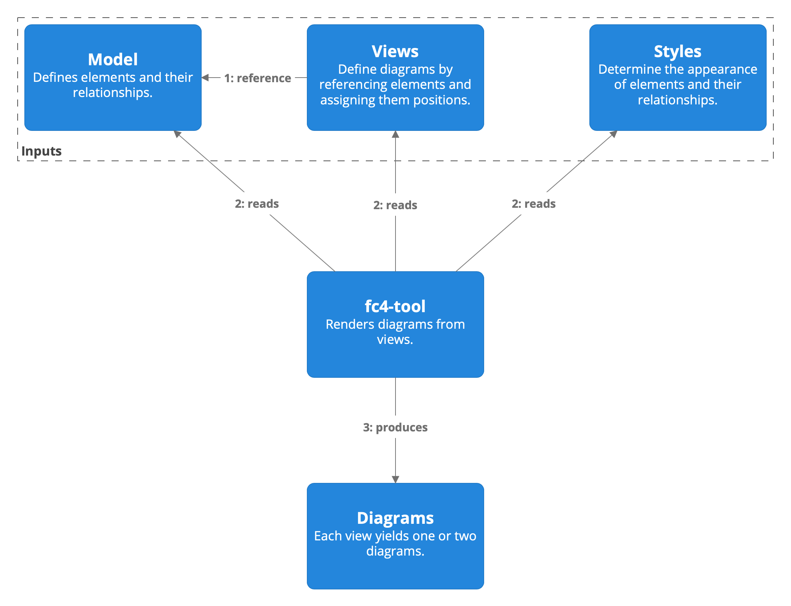

# FC4 Framework » [Getting Started](index.md) » Part 1: The Basics

## Basic Terms

<dl>
  <dt>corpus
  <dd>the set of files and directories that yield and include an organization’s FC4 diagrams

  <dt>landscape
  <dd>a set of related systems, users, datatypes, and datastores that are deployed together
      (each landscape usually corresponds to some bounded business context e.g. a platform, a
      region, a business unit, or an organization)
</dl>

## Inputs and Outputs

At the highest level, working with the FC4 framework involves creating “inputs” and passing them to
[fc4-tool](https://fundingcircle.github.io/fc4-framework/tool/), which outputs diagram images:

### Model

* Every FC4 corpus has a single model
* The model is a dataset that describes the elements that make up the landscapes and systems to be
  diagrammed
* Every element represents either a user, a system, a datatype, or a datastore
* Each element is defined once
* Elements reference each other in _relationships_ of various kinds, such as “uses”, “depends on”,
  “writes to”, etc.
  * The model is therefore also a graph
* In concrete terms, a model is a directory containing a set of YAML files

### Views

* Views define diagrams by referencing elements from the model and positioning them in specific
  locations on a canvas
* An element in the model may be referenced in many different views
* An FC4 corpus can have an unlimited number of views
* In concrete terms, each view is a YAML file

### Styles

* Every FC4 corpus has a single set of styles
* That set of styles is applied to every diagram
* In concrete terms, the set of styles is expressed in a YAML file

### Diagrams

* The results that fc4-tool yields: 1 or 2 diagrams per view
* In concrete terms, a diagram is a PNG file

----

OK, them’s the basics!

Before we start creating diagrams, we need to do some prep. And the specific
prep we need to do depends on this:

**Are you starting from scratch with FC4, or do you need to get up and running
with an existing FC4 corpus?**

Please choose your adventure:

* If are starting from scratch, turn to
  [page 2a](prep-starting-from-scratch.md)
* If you need to get up and running with an existing FC4 corpus, turn to
  [page 2b](prep-existing-corpus.md)
