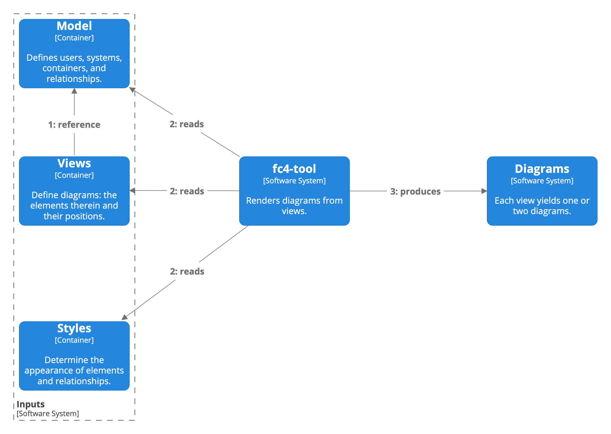

# FC4 Framework » [Getting Started](index.md) » Part 1: The Basics

At the highest level, working with the FC4 framework involves creating “inputs” and passing them to
fc4-tool, which outputs diagram images:

## Inputs
### Model
### Views
### Styles

## fc4-tool

## Outputs
