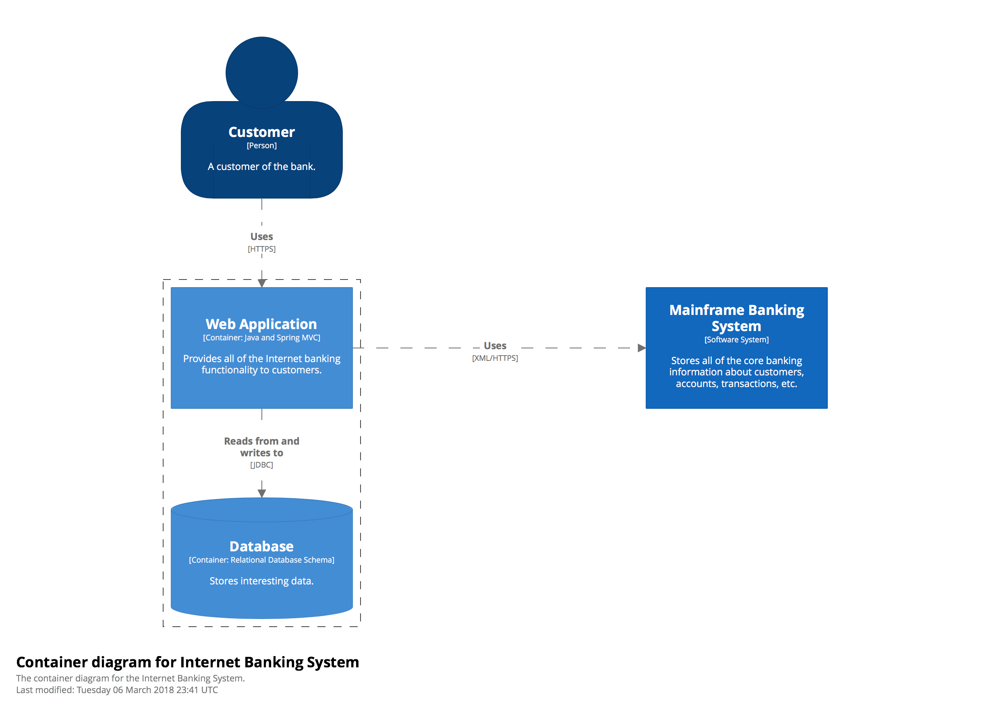

# 3. The Graphical Notation « The FC4 Methodology

The whole point of all of this is to create graphics, and we need those graphics to use a clear and consistent visual language.

For now we’re using Structurizr Express, a tool described in [The Toolset](4_Toolset.md), to render our diagrams. Its visual language is mostly fixed, apart for limited support for some custom styles. Most of our current graphical notation is therefore inherited from that tool. Since its output is of an acceptable caliber, this is actually a useful constraint for us right now; it allows us to focus on other aspects of this methodology..

## Example

This example is by [Simon Brown](http://simonbrown.je/):

### Key

----

Please continue to [The Toolset](4_Toolset.md) or go back to [the top page](README.md).
